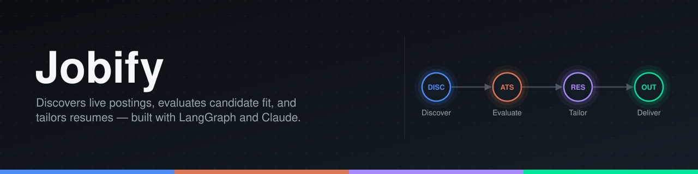
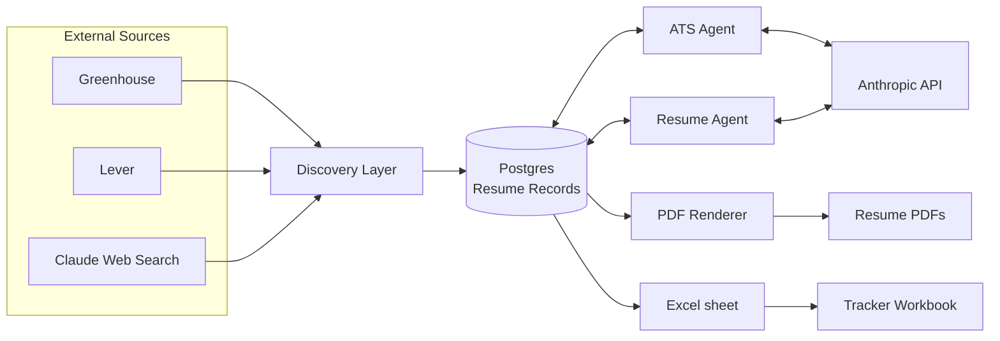
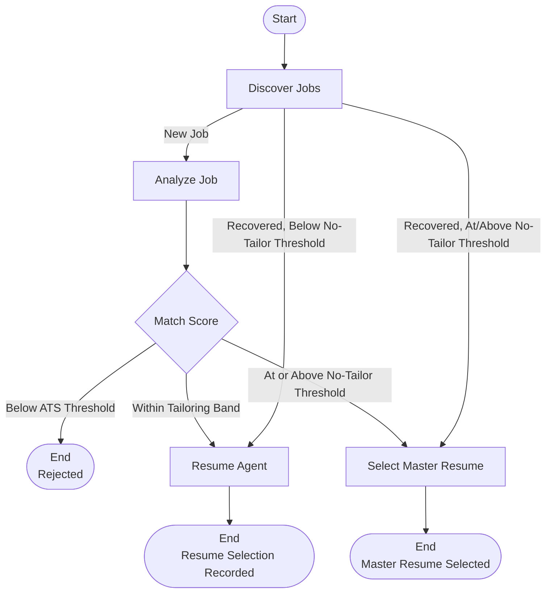

<div align="center">



# Jobify

**A multi-agent job application pipeline built with LangGraph and Claude**

`Discovery` · `Filtering` · `ATS Scoring` · `Resume Tailoring` · `Tracking`

[](https://www.python.org)
[](https://www.langchain.com/langgraph)
[](https://www.anthropic.com/claude)
[](https://neon.tech)
[](LICENSE)

```bash
git clone https://github.com/savsuth/jobify.git && cd jobify && pip install -e ".[dev]"
```

</div>

---

An unconstrained LLM pipeline for job search encounters two predictable failure modes. Aggregated postings introduce noise that the source data itself may fail to identify, including stale listings, duplicates across platforms, and positions requiring qualifications the candidate does not possess. Similarly, a model tasked with tailoring a resume for each posting, without explicit constraints on what it can assert, may fabricate experience or introduce unsupported claims, leading to more significant issues during resume generation.

Jobify addresses both failure modes by separating deterministic validation from model-driven reasoning. Before a posting enters the working pipeline, its location, employment type, role, and cross-source identity are resolved through code. Only postings that pass this initial validation are evaluated against their job descriptions and assigned an ATS score. Two purpose-built agents then take over. The first assesses the alignment between the posting and the candidate's master resume. The second determines whether tailoring the resume would improve the match and, when appropriate, generates the tailored resume according to the requirements.

For every qualifying job, the system generates the corresponding resume in PDF and LaTeX formats and records the application details in an Excel tracker.

---

## Who This Is For

- **Job seekers who keep a LaTeX resume as their source of truth** and want location, role, freshness, and duplicate identity resolved deterministically before any posting reaches an LLM, with tailoring restricted to evidence that already exists in their own record
- **Engineers evaluating LangGraph's `Send()` and `Command()` routing** in a pipeline where the fan-out, scoring, and recovery logic run against a real multi-source job feed rather than a toy graph

<div align="center">

[Architecture](#architecture) &nbsp;·&nbsp; [Discovery](#discovery) &nbsp;·&nbsp; [ATS Agent](#ats-agent) &nbsp;·&nbsp; [Resume Agent](#resume-agent) &nbsp;·&nbsp; [Quick Start](#quick-start) &nbsp;·&nbsp; [Module Reference](#module-reference)

</div>

---

## What Jobify Gives You

- **Pre-Filtering:** - Before a posting reaches Claude, the location, employment type, and role are resolved in code. This ensures that Claude does not make any LLM calls on postings that are not eligible.
- **Cross-Source Deduplication:** `(source, source_id)` catches same-source repeats, and a URL-derived `canonical_key` catches the same posting found again through a different source
- **Evidence-Bound Resume Tailoring:** A pool of citable projects and facts is computed in Python before the model runs, from the master resume, live GitHub context, and an approved project library: nothing outside that pool can be referenced
- **Full Pipeline Recovery:** - Each run automatically re-queries for jobs that were left unfinished or undecided by a previous run, preventing partial progress loss or unnecessary reprocessing of completed tasks.
- **Persisted Decision Trail:** Every job's discovery, score, and resume decision is a row in Postgres, rebuildable into an Excel workbook at any time
- **PDF Compilation:** - LaTeX resumes are compiled into PDF with the required page limit enforced by a byte-level page-count check.
---

## Why Jobify

| | Manual job search | Unconstrained LLM resume tool | **Jobify** |
|---|---|---|---|
| **Filtering before cost** | Ad hoc, by hand | None, every posting gets a full LLM pass | Deterministic filters run first; Claude only sees postings that already passed location, role, freshness, and identity checks |
| **Resume claims** | Bound by what the candidate writes by hand | Can invent experience to fit a posting | Restricted to a pool computed from the master resume, GitHub context, and an approved project library |
| **Duplicate handling** | Manual cross-referencing across tabs | Not addressed | `(source, source_id)` plus a URL-derived `canonical_key` catch same-source and cross-source repeats |
| **Recovery from a failed run** | Not applicable | Typically reruns the whole batch | `discover_jobs` re-queries for jobs missing a score or a resume decision on every run |
| **Auditability** | Whatever the candidate remembers | Prompt and output, if logged at all | Every job's discovery, score, and resume decision is a persisted database row |

---

## Quick Start

```bash
git clone https://github.com/savsuth/jobify.git
cd jobify
python3 -m venv .venv && source .venv/bin/activate
pip install -e ".[dev]"

cp .env.example .env               # set ANTHROPIC_API_KEY and DATABASE_URL

alembic upgrade head
python scripts/maintenance/seed_config.py
python scripts/run_pipeline.py
```

Environment variables, candidate-data setup, and threshold tuning are covered in full in [Installation](#installation) and [Configuration](#configuration).

Verify the run reached the database through the read API:

```bash
uvicorn src.api.main:app --reload &
curl -s http://127.0.0.1:8000/jobs | python3 -m json.tool | head -20
# → [{"id": 1, "source": "greenhouse", "company": "stripe", "title": "Software Engineer, Data Platform", "match_score": 74, "status": "passed", ...}]
```

---

## Architecture

Jobify runs as one LangGraph pipeline over a shared Postgres store: external sources feed the Discovery layer, every stage reads and writes the same database, and only the ATS and Resume agents ever call out to Claude.



| Component | Type | Responsibility | Output |
|---|---|---|---|
| LangGraph Pipeline | Orchestration | Coordinates and routes every job across all agents below, based on score, and recovers unfinished work | Graph state, run summary |
| Discovery Layer | Deterministic Python | Fetches Greenhouse, Lever, and web-search postings; normalizes, filters, and deduplicates them | `jobs` rows |
| ATS Agent | LLM (Claude) | Scores a job against the candidate's structured profile with a documented rationale | `job_analysis` row |
| Resume Agent | LLM (Claude) | Decides whether tailoring would help and, if so, generates it | `resume_selections` and `resume_drafts` rows |
| PDF Renderer | Deterministic Python | Converts LaTeX into a one-page PDF via `pdflatex` | `output/resumes/pdf/*.pdf` |
| Excel Tracker | Deterministic Python | Reads the database and writes a reviewable workbook | `output/job_tracker.xlsx` |

Only two components in this architecture make LLM calls. The rest are deterministic Python components. They are cheaper to run, faster, testable without mocking a model, and guaranteed to produce the same result on every run.

A single LLM prompt handling discovery, evaluation, and generation in one pass would have no intermediate point at which to verify its work, bound its cost, or catch a bad decision before it compounds. Jobify separates that work into three distinct stages instead, each solved using the method suited to it:

- **Discovery** is a data problem that does not require model judgment. It involves fetching data from several sources, normalizing their inconsistent shapes, and applying filters.
- **ATS analysis** is a judgment problem that requires a model capable of reading both the data and reasoning about the match. It determines whether a specific candidate fits a specific job.
- **Resume tailoring** is a generation problem that is bound by a correctness constraint. The output must remain factually accurate and work from a fixed, pre-approved pool of evidence rather than a blank page.

LangGraph coordinates these stages, managing the state and routing between them. Each agent is specialized and stateless between calls. Python code directly enforces the hard constraints, ensuring that a filter’s outcome for a given job remains identical on every run.

### LangGraph Orchestration

The pipeline is implemented as a [LangGraph](https://github.com/langchain-ai/langgraph) `StateGraph` (`src/graph/pipeline.py`) with four execution nodes: `discover_jobs`, `analyze_job`, `resume_agent`, and `select_master_resume`. State passed between them is explicitly typed.



`discover_jobs` fans new jobs out to `analyze_job` concurrently, using LangGraph's `Send()`. Recovered jobs that were already scored in a prior run skip `analyze_job` entirely and fan out straight to `resume_agent` or `select_master_resume`, keyed on their existing `match_score`, so a recovered job's score is never recomputed. Each `analyze_job` call scores one job and routes itself with `Command(goto=...)`: to `END` if the job is rejected, to `resume_agent` if the score falls within the tailoring band, or to `select_master_resume` if the score already exceeds the threshold at which the master resume requires no changes. Graph state carries the job, the profile, and the thresholds each node requires, while the database remains the actual system of record; each node persists its own row before returning.

State is explicit and typed. The top-level graph state, `PipelineState` (a `TypedDict`), carries what is constant for the whole run: the candidate profile, both thresholds, the master resume, and GitHub context. It also carries a `results` field that accumulates one `JobResult` per completed job through LangGraph's built-in reducer (`Annotated[list[JobResult], operator.add]`), so concurrent `Send()` branches can each append their own outcome without overwriting one another. Each node that `Send()` fans out to declares its own narrower schema: `JobAnalysisState`, `ResumeAgentState`, `SelectMasterState`, scoped to only the fields that node needs. A node writes back to shared state only through the `update` argument of the `Command` it returns.

Recovery is implemented within the graph itself. On every run, `discover_jobs` re-queries for jobs that were persisted but still missing a score, and separately for jobs that were scored but still missing a resume decision. A run that stops partway through loses no work: the next run re-validates that work against the current eligibility and freshness rules before resuming it.

LangGraph's advantage over a hand-written loop lies in its `Send()` fan-out and the per-branch routing it enables: a variable number of jobs can be scored concurrently, each one independently determining its own next step, without the orchestration code having to track which job is where. A hand-written loop would have to reimplement that bookkeeping for every new routing rule.

### How The Agents Work Together

The agents coordinate their actions through persistent job and analysis states in the database. The Discovery layer normalizes and filters a raw posting into a `Job` row, considering factors like `current_eligibility` and posting freshness. It also passes along the `id`, `canonical_key`, and description of the job.

The ATS Agent then reads the description alongside the candidate’s structured profile and calculates a `match_score`, status, and reasoning. It writes these values back to the `job_analysis` table. Only jobs with a score that meets the configured threshold are considered for further processing.

Next, the Resume Agent reads the job, the ATS result, the master resume, and GitHub context. It then decides whether to tailor the resume or leave it unchanged. If it tailors the resume, it generates the LaTeX code and a `draft_id` and writes them to the `resume_drafts` table. Additionally, it creates a `resume_selections` table that records which resume was used and the reason for the choice.

Finally, the PDF renderer and the Excel tracker complete the loop by reading the same `id` and `draft_id` to generate a consistent and deterministic filename and link. Each stage in the process reuses the decisions made by earlier stages.

### Deterministic Logic Versus AI Logic

Hard constraints are deterministic; model-based reasoning is employed only when interpretation or generation is genuinely necessary. The following are resolved through code, verified by tests, and reproduced identically on every run:

- US location, full-time employment, and target role filtering
- Posting freshness and cross-source canonical identity
- Database identity and artifact naming
- PDF page-count verification after every compile

A model is tasked with exercising judgment in precisely two locations, both of which necessitate reading and reasoning about unstructured text:

- Applicant Tracking System (ATS) evaluation, assessing the suitability of a specific resume for a specific job
- Resume tailoring, determining whether and how a resume should be adapted for a particular job

The first list is consistently resolved through code; the second always requires a model, as both judgments demand genuine interpretation of unstructured text.

---

## Discovery

The Discovery layer collects candidate postings from configured sources and normalizes them into a standardized representation before any downstream processing occurs. Three source adapters perform this task: `greenhouse.py` and `lever.py` retrieve postings directly from each company’s public board API, while `web_search.py` utilizes Claude’s web-search tool to surface postings from external platforms. Lever provides an authoritative country code, Greenhouse provides an office list and a `first_published` date, and web search provides the posting text itself, from which the remaining fields are derived.

Each fetched posting undergoes a deterministic filter to determine eligibility for US location, full-time employment, and the target role before being persisted. A `current_eligibility` check re-validates each job against the current rules on every retry, ensuring historical rows remain reassessable over time. Freshness is determined from each posting’s publish date, `posted_at`, within a configurable window set by `posted_within_days` (default 7 days).

---

## ATS Agent

The Automated Talent Screening (ATS) Agent executes the model-driven job-fit analysis, performing one Claude call per job through the `score_job` function. Given the job description and the candidate’s structured profile, it returns a `match_score`, which provides a breakdown of the hard and preferred requirements that are met or missing, along with a concise rationale grounded in specific facts from both sources. The prompt restricts the candidate’s credit to only what is explicitly present in their profile. The `search_config.ats_threshold`, retrieved from the database, determines whether the job proceeds to the Resume Agent. A malformed or incomplete Claude response raises a diagnosable error instead of crashing the run; that job is left unscored and retried during the next run.

---

## Resume Agent

The Resume Agent utilizes the output of the Applicant Tracking System (ATS) and the candidate’s evidence to determine whether tailoring is required. For jobs that fall within a configurable tailoring range between `ats_threshold` and `resume_no_tailor_threshold`, the ATS result serves as a read-only context for a presentation decision. At or above `resume_no_tailor_threshold`, the match is deemed strong enough that the master resume is used without modification, and no Claude call is initiated. Within the specified range, the agent’s behavior adapts to the score: towards the lower end, it actively seeks a legitimate improvement; towards the upper end, it defaults to retaining the master resume unless a specific and meaningful change is warranted.

Neither threshold is predefined by the system. Both `ats_threshold` and `resume_no_tailor_threshold` are ordinary fields in the single-row `search_config` table and can be assigned any value. The current range of 30–65 reflects a personal preference rather than a system default, established in part to assess, through live scraping, how the current job market aligns with the candidate’s actual profile.

The Resume Agent adopts a conservative approach to modifications. It may reorganize and selectively tailor the candidate’s existing evidence, but it cannot introduce technologies the candidate has not utilized, metrics that do not exist, production experience lacking from an academic project, or scales of system the candidate has not developed. The pool of projects that can be referenced is computed once in Python before the model executes, drawn from the master resume, live GitHub context, and the Candidate Project Library. A project outside this pool cannot be referenced, regardless of the job description’s requirements. Tailoring involves selecting and reordering existing evidence, not fabricating it. A subsequent deterministic verification ensures that any GitHub facts reported by the model were indeed supplied to it.

---

## Candidate Project Library

The `data/candidate_projects/` directory extends the tailoring pool by incorporating GitHub projects that have not yet been converted into resume bullets. Each project is ingested in three distinct layers: its supporting materials, the facts derived from it, and template-generated bullets. This approach ensures that no content is fabricated during the process. Every ingested project initially enters a `needs_review` state, requiring explicit human approval before the Resume Agent can access it. This allows the tailoring pool to encompass more than the master resume without introducing unverified claims.

The library is maintained as local files under version control, rather than hosted in a centralized store. This deliberate choice is made since the system currently serves only a single candidate. Migrating the library into the database, caching it, and extracting it only upon changes, similar to the candidate profile, would reduce the frequency of repeated calls to Claude if the system ever requires scalability.

---

## GitHub Integration

The `src/integrations/github.py` module provides the Resume Agent with authentic and current repository information for projects already linked from the master resume. It serves as supporting evidence rather than a replacement for the resume or the profile.

The `extract_project_repos()` function identifies every `github.com/OWNER/REPO` link within the resume’s LaTeX format. Subsequently, the `fetch_repo_context()` function retrieves the description, programming languages, topics, and a README excerpt for each repository. It returns `None` for any missing, private, or unavailable information instead of making assumptions.

The `fetch_github_context()` function serves as the pipeline’s entry point. It is executed once per run, not once per job, and is scoped to repositories already referenced in the resume.

The `list_account_repos()` and `fetch_repo_root_contents()` functions are broader discovery primitives utilized exclusively by the offline, human-operated `scripts/maintenance/build_project_library.py` script. They are not employed by the live pipeline.

The `GITHUB_TOKEN` parameter is optional. Without it, requests fall back to GitHub’s unauthenticated rate limit, which is sufficient for normal, low-frequency usage.

---


## Identity And Deduplication

The `(source, source_id)` pattern captures repetitions from the same source. For instance, Greenhouse and Lever each use their unique native posting ID. The `canonical_key` extends this coverage to the same real posting found twice through different sources, a source-independent identity derived from the posting URL itself. A job discovered once through web search and later through the native Lever connector resolves to the same `canonical_key` and is recognized as a single job rather than persisted twice. Both checks are precise and structural, constructed entirely from posting IDs and URLs, never from title or company text similarity.

---

## Outputs

The pipeline generates precisely two outputs for every job that reaches this stage: a resume that the candidate can submit and a row in the Excel tracker recording the job’s outcome. Both outputs are deterministically generated from the database.

Every resume decision produces two artifacts: the generated LaTeX source (`.tex`, which is retained on disk for reproducibility) and the compiled PDF (the artifact that the candidate submits). Both the tailored and master paths compile using the same `pdflatex` toolchain, with a one-page limit enforced. A multi-page result or a failed compile yields no PDF; only the `.tex` file is generated. The PDF is named deterministically as `USER-NAME-<COMPANY>.pdf`, with a `-2` suffix only when a second PDF is generated.

`scripts/reporting/build_job_tracker.py` rebuilds a workbook directly from the live database. Each row in the workbook consolidates the complete pipeline record for that job, including posting details, freshness and eligibility classification, the ATS result, the resume decision, and, once generated, the resume draft’s metadata and a link to its PDF. This data is organized across sheets: **CURRENT TARGETS** (currently eligible jobs), **JOBS** (a full history of all jobs), **REVIEW** (ambiguous eligibility), **DUPLICATES** (canonical-key groups and which row represents each), **RESUMES**, and **SUMMARY**. A **NEW JOBS** sheet is added by the run-scoped validation scripts under `scripts/validation/`, but it is not part of a normal rebuild. Every Job URL and Resume PDF link is clickable, and the resume link is written only once the PDF is confirmed to exist on disk.

---

## Database

The database is hosted on [Neon](https://neon.tech), a serverless Postgres platform, reached over the standard Postgres wire protocol through `DATABASE_URL`. The schema and query layer use only standard Postgres features, so any standard instance works as a drop-in replacement.

| Model | Purpose |
|---|---|
| `jobs` | One row per canonical posting: source identity, `canonical_key`, `current_eligibility`, `posted_at` |
| `job_analysis` | ATS score, status, and reasoning, one row per job |
| `resume_selections` | Which resume was used for a job and why |
| `resume_drafts` | Tailored LaTeX version history |
| `search_config` | The single-row runtime configuration: company boards, thresholds, freshness window |

Historical rows persist indefinitely. A job that no longer meets today's rules is marked ineligible, keeping its record intact.

---

## Reliability

- Claude JSON responses are never parsed using a bare `json.loads`. Malformed or incomplete output raises a diagnosable error instead of crashing the run.
- A failed Claude call is isolated to a single job; the run continues, and that job is retried automatically the next time.
- PDF generation is fail-safe: a bad or multi-page compile never produces an incorrect PDF, and a deterministic page-count check verifies every artifact before it is linked.
- Resume filenames and file paths are computed the same way at generation time and at report time, ensuring they never drift apart.

---

## Module Reference

<details>
<summary><b><code>src.discovery.aggregate</code></b>: Fetch And Filter</summary>
<a id="srcdiscoveryaggregate-fetch-and-filter"></a>

Fetches every configured Greenhouse and Lever board, normalizes the results into `NormalizedJob`, and applies the location, employment-type, and role filters before anything is persisted.

```python
from src.discovery.aggregate import discover_candidates

by_company, stats = discover_candidates(config)  # config: the search_config row
# → stats == {"raw_fetched": 842, "non_us_rejected": 211, "title_rejected": 528, "eligible": 50, ...}
```

</details>

<details>
<summary><b><code>src.discovery.normalize.canonical_job_identity</code></b>: Cross-Source Identity</summary>
<a id="srcdiscoverynormalizecanonical_job_identity-cross-source-identity"></a>

Derives a source-independent key from a posting URL: a Lever or Greenhouse path URL keyed on company slug and native ID, a Greenhouse `gh_jid` query URL keyed on that ID alone, or a normalized generic URL as the weakest, still-exact fallback. Never raises, so it is always safe to use as a dict key.

```python
from src.discovery.normalize import canonical_job_identity

canonical_job_identity("https://jobs.lever.co/palantir/8f14e45f-ceea-4a9d-8e13-000000000001")
# → "lever:palantir:8f14e45f-ceea-4a9d-8e13-000000000001"
```

</details>

<details>
<summary><b><code>src.analysis.ats_agent.score_job</code></b>: ATS Scoring</summary>
<a id="srcanalysisats_agentscore_job-ats-scoring"></a>

Makes one Claude call per job, restricted to crediting the candidate only with what is literally present in their structured profile.

```python
from src.analysis.ats_agent import score_job

result = score_job(job_description=job.description_raw, candidate_profile=profile)
# → ATSResult(match_score=74, hard_requirements_met=["3+ years Python", "SQL"],
#             hard_requirements_missing=["Kubernetes"], reasoning="...")
```

</details>

<details>
<summary><b><code>src.resume.resume_agent.decide_and_tailor</code></b>: Tailoring Decision</summary>
<a id="srcresumeresume_agentdecide_and_tailor-tailoring-decision"></a>

Called only for jobs in the tailoring band, between `ats_threshold` and `resume_no_tailor_threshold`. Decides whether tailoring would improve the match and, if so, generates it strictly from the pre-approved evidence pool.

```python
from src.resume.resume_agent import decide_and_tailor

decision = decide_and_tailor(
    job_description=job.description_raw,
    ats_result=ats_result,
    master_raw_latex=master_latex,
    candidate_profile=profile,
    github_context=github_context,
    match_score=58,
)
# → ResumeDecision(zone="selective", tailoring_needed=True, tailored_latex="...",
#                   github_facts_used=[...], reasoning="...")
```

</details>

<details>
<summary><b><code>src.resume.pdf_render.compile_tex_to_pdf</code></b>: PDF Compilation</summary>
<a id="srcresumepdf_rendercompile_tex_to_pdf-pdf-compilation"></a>

Compiles a `.tex` file through `pdflatex` into `pdf_path`; it only writes `pdf_path` on a complete, exactly-one-page success, so a caller can treat "no exception" as "a correct PDF now exists."

```python
from pathlib import Path
from src.resume.pdf_render import compile_tex_to_pdf, PdfRenderError

try:
    compile_tex_to_pdf(Path("output/resumes/tex/AASAV-SUTHAR-STRIPE.tex"), Path("output/resumes/pdf/AASAV-SUTHAR-STRIPE.pdf"))
except PdfRenderError as exc:
    # missing pdflatex, a compile error, or a result that isn't exactly one page
    print(exc)
```

</details>

---

## Features At A Glance

| Capability | Highlights |
|---|---|
| Discovery | Greenhouse and Lever public board APIs plus Claude web search, normalized into one `NormalizedJob` shape |
| Deterministic filtering | US location, full-time employment, target role, and freshness resolved in code before any Claude call |
| Deduplication | `(source, source_id)` and a URL-derived `canonical_key` catch same-source and cross-source repeats |
| Work-authorization gate | Conservative regex classification into `eligible` / `ineligible` / `unknown`, routed before ATS scoring |
| ATS Agent | One Claude call per job, profile-grounded score with hard/preferred requirement breakdown |
| Resume Agent | Tailoring band gated by two configurable thresholds; evidence pool fixed before the model runs |
| Candidate Project Library | GitHub-derived projects held in `needs_review` until human-approved for the tailoring pool |
| Pipeline recovery | `discover_jobs` re-surfaces unscored and undecided jobs on every run |
| PDF rendering | `pdflatex` compile with a byte-verified one-page limit; failure never yields a bad PDF |
| Excel tracker | Six sheets rebuilt directly from the live database, with clickable job and resume links |
| Read API | FastAPI `GET /jobs` and `GET /jobs/{id}`, read-only |

---

## Testing And Validation

**Automated Suite:** The automated suite comprises 327 tests that successfully pass under pytest, ensuring that network access is disabled. Every Claude and HTTP call is meticulously mocked. This comprehensive suite encompasses the following functionalities:

- Discovery source parsing and the application of deterministic filters
- Eligibility and freshness classification
- Canonical-identity deduplication
- The LangGraph pipeline’s routing and recovery behavior
- The Resume Agent’s evidence constraints
- PDF artifact generation
- The Excel reporting logic

**Live Validation:** In addition to the automated suite, the system has undergone extensive live validation against real Greenhouse, Lever, and web-search sources. These live runs utilized authentic Claude API calls, verifying the correctness of the filters, freshness gate, and deduplication mechanisms against live postings. Furthermore, every generated PDF has been byte-verified as a genuine one-page artifact.

---

## Installation

Requires Python 3.11+, a Postgres database (this project runs on [Neon](https://neon.tech); any standard instance works), an Anthropic API key, and `pdflatex` (BasicTeX or TeX Live) for PDF generation.

**1. Clone the repository and install dependencies**

```bash
git clone https://github.com/savsuth/jobify.git
cd jobify
python3 -m venv .venv && source .venv/bin/activate
pip install -e ".[dev]"
```

**2. Configure environment variables**

```bash
cp .env.example .env
```

| Variable | Required | Purpose |
|---|---|---|
| `ANTHROPIC_API_KEY` | Yes | Claude calls made by the ATS Agent and Resume Agent |
| `DATABASE_URL` | Yes | Postgres connection string: a local instance (`postgresql+psycopg://localhost:5432/job_application_agent`) or the connection string from your Neon project dashboard (requires `?sslmode=require`) |
| `GITHUB_TOKEN` | No | Raises the GitHub API rate limit; not required for normal use |

**3. Create the database and apply migrations**

```bash
createdb job_application_agent   # local Postgres only, skip on Neon: the database already exists
alembic upgrade head
```

**4. Provide your own candidate data**

Replace `profile/resume.tex` with a real resume, and edit `config/preferences.yaml` with your job-search preferences: companies, thresholds, freshness window (see [Configuration](#configuration) below).

**5. Seed the database from configuration**

```bash
python scripts/maintenance/seed_config.py
```

Re-run this step whenever `config/preferences.yaml` changes, since the pipeline always reads its configuration from the database.

---

## Running

```bash
python scripts/run_pipeline.py                    # full pipeline: discovery → ATS → resume → PDFs
python scripts/reporting/build_job_tracker.py      # rebuild the Excel tracker
uvicorn src.api.main:app --reload                  # read-only API: GET /jobs, GET /jobs/{id}
pytest                                             # run the test suite
```

`run_pipeline.py` is safe to re-run: already-discovered jobs are skipped, already-scored jobs are left alone, and unfinished work from a failed run is picked up automatically.

---

## Configuration

The runtime settings reside in the `config/preferences.yaml` file and are subsequently populated into the database via the `scripts/maintenance/seed_config.py` script. The pipeline consistently retrieves its configuration from the database, necessitating a rerun of this script after any modifications. This script controls the selection of Greenhouse and Lever boards to be fetched, the freshness window (`posted_within_days`, default value is 7, and can be disabled by setting it to `null`), the `ats_threshold`, the `resume_no_tailor_threshold`, and the `max_jobs_per_run` parameters.

**Security Warning:** Refrain from committing `.env` or a genuine API key. The `output/` directory is Git-ignored and can be regenerated from the database at any time.

---

## License

[MIT](LICENSE)
