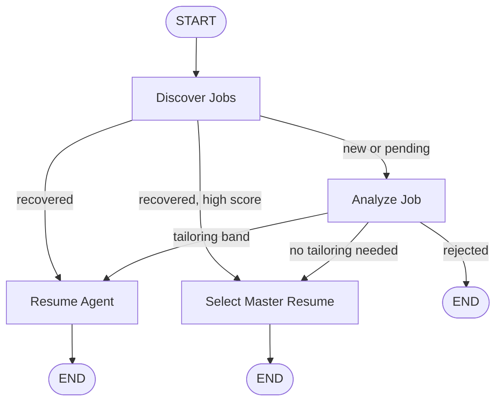
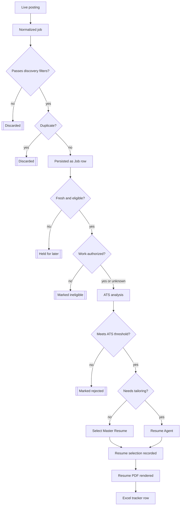

<p align="center">
  
</p>

# Jobify

A multi-agent job application system built with LangGraph and Claude that discovers and filters live job postings, analyzes candidate-job fit, and generates tailored resumes for relevant opportunities.

[](https://www.python.org)
[](https://www.langchain.com/langgraph)
[](https://www.anthropic.com/claude)
[](https://neon.tech)
[](LICENSE)

## Overview

An unconstrained LLM pipeline for job search fails in two predictable ways. Aggregated postings carry noise the source data never flags on its own — stale listings, duplicates across platforms, and postings whose citizenship or clearance requirements the candidate doesn't meet. A model asked to tailor a resume for every posting, with no limit on what it can claim, will invent experience the candidate doesn't have whenever fabrication produces a stronger match.

Jobify addresses both failure modes with a strict separation between deterministic validation and model-driven reasoning. Location, employment type, role, freshness, and cross-source identity are resolved in code before a posting ever reaches an LLM. Only postings that survive that filtering are evaluated against their description and assigned an ATS score. From there, two purpose-built agents take over: one evaluates fit against the candidate's actual resume, and the other determines whether tailoring would improve the match, generating it only from evidence already on record.

For every qualifying job, the system assembles one complete application record: a resume — master or tailored — and a row in the Excel tracker.

## Why a Multi-Agent Architecture

A single LLM prompt handling discovery, evaluation, and generation in one pass would have no intermediate point at which to verify its work, bound its cost, or catch a bad decision before it compounds. Jobify separates that work into three discrete stages instead, each solved with the method suited to it:

- **Discovery** is a data problem: fetch from several sources, normalize their inconsistent shapes, and apply hard filters. It requires no model judgment.
- **ATS analysis** is a judgment problem: whether a specific candidate fits a specific job. That requires a model capable of reading both and reasoning about the match.
- **Resume tailoring** is a generation problem with a correctness constraint — the output must remain factually accurate. It also requires a model, but one working from a fixed, pre-approved pool of evidence rather than a blank page.

LangGraph coordinates these stages, owning state and routing between them. Each agent is specialized and stateless between calls, and deterministic Python code enforces the hard constraints directly — a filter's outcome for a given job is identical on every run.

## Agent architecture

| Component | Type | Responsibility | Output |
|---|---|---|---|
| LangGraph Pipeline | Orchestration | Coordinates and routes every job across all agents below, based on score, and recovers unfinished work | Graph state, run summary |
| Discovery Layer | Deterministic Python | Fetches Greenhouse, Lever, and web-search postings; normalizes, filters, and deduplicates them | `jobs` rows |
| ATS Agent | LLM (Claude) | Scores a job against the candidate's structured profile with a documented rationale | `job_analysis` row |
| Resume Agent | LLM (Claude) | Decides whether tailoring would help and, if so, generates it | `resume_selections` and `resume_drafts` rows |
| PDF Renderer | Deterministic Python | Converts LaTeX into a one-page PDF via `pdflatex` | `output/resumes/pdf/*.pdf` |
| Excel Tracker | Deterministic Python | Reads the database and writes a reviewable workbook | `output/job_tracker.xlsx` |

Only two components in this architecture make LLM calls. The rest are deterministic Python components — cheaper to run, faster, testable without mocking a model, and guaranteed to produce the same result on every run.

## LangGraph orchestration

The pipeline is implemented as a [LangGraph](https://github.com/langchain-ai/langgraph) `StateGraph` (`src/graph/pipeline.py`) with four execution nodes — `discover_jobs`, `analyze_job`, `resume_agent`, and `select_master_resume` — and explicitly typed state passed between them.



`discover_jobs` fans new and recovered jobs out to `analyze_job` concurrently, using LangGraph's `Send()`. Each `analyze_job` call scores one job and routes itself with `Command(goto=...)`: to `END` if the job is rejected, to `resume_agent` if the score falls within the tailoring band, or to `select_master_resume` if the score already exceeds the threshold at which the master resume requires no changes. Graph state carries the job, the profile, and the thresholds each node requires, while the database remains the actual system of record — each node persists its own row before returning.

State is explicit and typed. The top-level graph state, `PipelineState` (a `TypedDict`), carries what is constant for the whole run — the candidate profile, both thresholds, the master resume, and GitHub context — plus a `results` field that accumulates one `JobResult` per completed job through LangGraph's built-in reducer (`Annotated[list[JobResult], operator.add]`), so concurrent `Send()` branches can each append their own outcome without overwriting one another. Each node that `Send()` fans out to declares its own narrower schema — `JobAnalysisState`, `ResumeAgentState`, `SelectMasterState` — scoped to only the fields that node needs. A node writes back to shared state only through the `update` argument of the `Command` it returns.

Recovery is implemented within the graph itself. On every run, `discover_jobs` re-queries for jobs that were persisted but still missing a score, and separately for jobs that were scored but still missing a resume decision. A run that stops partway through loses no work: the next run re-validates that work against the current eligibility and freshness rules before resuming it.

LangGraph's advantage over a hand-written loop lies in its `Send()` fan-out and the per-branch routing it enables: a variable number of jobs can be scored concurrently, each one independently determining its own next step, without the orchestration code having to track which job is where. A hand-written loop would have to reimplement that bookkeeping for every new routing rule.

## How the Agents Work Together

The agents coordinate through persisted job and analysis state in the database: the Discovery layer normalizes and filters a raw posting into a `Job` row, gated on `current_eligibility` and posting freshness, and carries its `id`, `canonical_key`, and description forward. The ATS Agent reads that description alongside the candidate's structured profile and writes a `match_score`, a status, and its reasoning back to `job_analysis`; only a job whose score meets the configured threshold moves on. The Resume Agent then reads the job, the ATS result, the master resume, and GitHub context, decides whether to tailor the resume or leave it unchanged, and — when it tailors — writes the generated LaTeX and a `draft_id` to `resume_drafts`, alongside a `resume_selections` row recording which resume was used and why. The PDF renderer and the Excel tracker close the loop, reading that same `id` and `draft_id` to resolve one consistent, deterministic filename and link — every stage reuses the decision an earlier one already made.

## Deterministic logic versus AI logic

Hard constraints are deterministic; model-based reasoning is used only where interpretation or generation is genuinely required. The following are resolved by code, verified by tests, and reproduced identically on every run:

- US location, full-time employment, and target role filtering
- posting freshness and cross-source canonical identity
- database identity and artifact naming
- PDF page-count verification after every compile

A model is asked to exercise judgment in exactly two places, both of which require reading and reasoning about unstructured text:

- ATS evaluation, judging how well a specific resume fits a specific job
- resume tailoring, judging whether and how the resume should be adapted for it

The first list is always resolved by code; the second always requires a model, since both judgments demand genuine interpretation of unstructured text.

## Discovery

The Discovery layer collects candidate postings from configured sources and normalizes them into a common representation before anything downstream ever encounters them. Three source adapters perform this work: `greenhouse.py` and `lever.py` retrieve postings directly from each company's public board API, while `web_search.py` employs Claude's web-search tool to surface postings from outside those two platforms. Lever provides an authoritative country code, Greenhouse provides an office list and a `first_published` date, and web search provides the posting text itself, from which the remaining fields are derived.

Every fetched posting is subjected to a deterministic filter for US location, full-time employment, and target role before being persisted, and a `current_eligibility` check re-validates each job against the current rules on every retry, ensuring historical rows remain reassessable over time. Freshness is determined from each posting's own publish date, `posted_at`, within a configurable window set by `posted_within_days` (default 7 days).

## ATS Agent

The ATS Agent performs the model-driven job-fit analysis, making one Claude call per job through `score_job`. Given the job description and the candidate's structured profile, it returns a `match_score`, a breakdown of which hard and preferred requirements are met or missing, and a short rationale grounded in specific facts from both. The prompt restricts the candidate's credit strictly to what is literally present in their profile. `search_config.ats_threshold`, read from the database, determines whether the job proceeds to the Resume Agent. A malformed or incomplete Claude response raises a diagnosable error instead of crashing the run — that job is left unscored and retried on the next run.

## Resume Agent

The Resume Agent uses the ATS result and the candidate's evidence to determine whether tailoring is necessary, making one Claude call — `decide_and_tailor` — for jobs that fall within a configurable tailoring band between `ats_threshold` and `resume_no_tailor_threshold`. The ATS result serves only as read-only context for a presentation decision. At or above `resume_no_tailor_threshold`, the match is already considered strong enough that the master resume is used without modification, and no Claude call is made. Within the band, the agent's behavior shifts with the score: toward the lower end, it actively seeks a legitimate improvement; toward the upper end, it defaults to retaining the master resume unless a specific, meaningful change is warranted.

Neither threshold is fixed by the system — both `ats_threshold` and `resume_no_tailor_threshold` are ordinary fields on the single-row `search_config` table and can be set to any value. The current 30–65 band reflects a personal choice rather than a system default, set in part to assess, through live scraping, how the current job market scores against the candidate's actual profile.

The Resume Agent is deliberately conservative about what it can change. It may reorganize and selectively tailor the candidate's existing evidence, but it cannot introduce a technology the candidate has not used, a metric that does not exist, production experience an academic project lacks, or a scale of system the candidate has never built. The pool of projects it may cite is computed once in Python before the model runs, drawn from the master resume, live GitHub context, and the Candidate Project Library — a project outside that pool cannot be referenced, regardless of what the job description requests. Tailoring consists of selecting and reordering real evidence. A deterministic check afterward verifies that any GitHub fact the model reports using was indeed supplied to it.

## Candidate Project Library

`data/candidate_projects/` extends the tailoring pool with real GitHub projects that were never converted into resume bullets. Each project is ingested as three separate layers — its supporting material, the facts derived from it, and template-generated bullets — so that nothing is invented at the bullet-writing stage. Every ingested project begins in a `needs_review` state, and a human must explicitly approve it before the Resume Agent can see it, allowing the tailoring pool to include more than the master resume without introducing unverified claims.

The library lives as local files under version control rather than in a hosted store, a deliberate choice while the system serves a single candidate. Migrating it into the database instead — cached and re-extracted only on change, in the same manner as the candidate profile — would reduce repeated Claude calls should the system ever need to scale.

## Data flow



## Identity and deduplication

`(source, source_id)` catches repeats from the same source: Greenhouse and Lever each use their own native posting ID. `canonical_key` extends that coverage to the same real posting found twice through different sources — a source-independent identity derived from the posting URL itself. A job discovered once through web search and later through the native Lever connector resolves to the same `canonical_key` and is recognized as one job rather than persisted twice. Both checks are exact and structural, built entirely from posting IDs and URLs.

## Outputs

The pipeline delivers exactly two outputs for every job that reaches this stage: a resume the candidate can submit, and a row in the Excel tracker recording that job's outcome. Both are produced deterministically from the database.

Every resume decision produces two artifacts: the generated LaTeX source (`.tex`, kept on disk for reproducibility) and the compiled PDF (the artifact the candidate submits). Both the tailored and master paths compile through the same `pdflatex` toolchain, with a one-page limit enforced — a multi-page result or a failed compile yields no PDF, only the `.tex`. The PDF is named deterministically as `AASAV-SUTHAR-<COMPANY>.pdf`, with a `-2` suffix only when a second, genuinely different tailored resume exists for the same company.

`scripts/reporting/build_job_tracker.py` rebuilds a workbook directly from the live database, and each row consolidates that job's complete pipeline record: posting details, freshness and eligibility classification, the ATS result, the resume decision, and — once generated — the resume draft's metadata and a link to its PDF. That data is organized across sheets — **CURRENT TARGETS** (currently eligible jobs), **JOBS** (full history), **REVIEW** (ambiguous eligibility), **DUPLICATES** (canonical-key groups and which row represents each), **RESUMES**, and **SUMMARY**. A **NEW JOBS** sheet is added by the run-scoped validation scripts under `scripts/validation/`, but it is not part of a normal rebuild. Every Job URL and Resume PDF link is clickable, and the resume link is written only once the PDF is confirmed to exist on disk.

## Database

The database is hosted on [Neon](https://neon.tech), a serverless Postgres platform, reached over the standard Postgres wire protocol through `DATABASE_URL` — the schema and query layer use only standard Postgres features, so any standard instance works as a drop-in replacement.

| Model | Purpose |
|---|---|
| `jobs` | One row per canonical posting — source identity, `canonical_key`, `current_eligibility`, `posted_at` |
| `job_analysis` | ATS score, status, and reasoning, one row per job |
| `resume_selections` | Which resume was used for a job and why |
| `resume_drafts` | Tailored LaTeX version history |
| `search_config` | The single-row runtime configuration — company boards, thresholds, freshness window |

Historical rows persist indefinitely. A job that no longer meets today's rules is marked ineligible, keeping its record intact.

## Reliability

- Claude JSON responses are never parsed with a bare `json.loads` — malformed or incomplete output raises a diagnosable error instead of crashing the run
- A failed Claude call is isolated to one job; the run continues, and that job is retried automatically next time
- PDF generation fails safe — a bad or multi-page compile never produces an incorrect PDF, and a deterministic page-count check verifies every artifact before it is linked
- Resume filenames and file paths are computed the same way at generation time and at report time, so they can never drift apart

## Testing and validation

**Automated suite.** 327 tests pass under `pytest`, with no network access — every Claude and HTTP call is mocked. Together, they cover:

- discovery source parsing and the deterministic filters
- eligibility and freshness classification
- canonical-identity deduplication
- the LangGraph pipeline's routing and recovery behavior
- the Resume Agent's evidence constraints
- PDF artifact generation
- the Excel reporting logic

**Live validation.** Beyond the mocked suite, the system has been run end to end against real Greenhouse, Lever, and web-search sources, using real Claude API calls. These runs confirmed that the filters, freshness gate, and deduplication behave correctly against live postings, and that every generated PDF is byte-verified as a genuine one-page artifact.

## Setup

Requires Python 3.11+, a Postgres database (this project runs on [Neon](https://neon.tech); any standard instance works), an Anthropic API key, and `pdflatex` (BasicTeX or TeX Live) for PDF generation.

**1. Clone the repository and install dependencies**

```bash
git clone https://github.com/savsuth/jobify.git
cd jobify
python3 -m venv .venv && source .venv/bin/activate
pip install -e ".[dev]"
```

**2. Configure environment variables**

```bash
cp .env.example .env
```

| Variable | Required | Purpose |
|---|---|---|
| `ANTHROPIC_API_KEY` | Yes | Claude calls made by the ATS Agent and Resume Agent |
| `DATABASE_URL` | Yes | Postgres connection string — a local instance (`postgresql+psycopg://localhost:5432/job_application_agent`) or the connection string from your Neon project dashboard (requires `?sslmode=require`) |
| `GITHUB_TOKEN` | No | Raises the GitHub API rate limit; not required for normal use |

**3. Create the database and apply migrations**

```bash
createdb job_application_agent   # local Postgres only — on Neon the database already exists, so skip this and set DATABASE_URL directly
alembic upgrade head
```

**4. Provide your own candidate data**

Replace `profile/resume.tex` with a real resume, and edit `config/preferences.yaml` with your job-search preferences — companies, thresholds, freshness window (see [Configuration](#configuration) below).

**5. Seed the database from configuration**

```bash
python scripts/maintenance/seed_config.py
```

Re-run this step whenever `config/preferences.yaml` changes, since the pipeline always reads its configuration from the database.

## Running

```bash
python scripts/run_pipeline.py                    # full pipeline: discovery → ATS → resume → PDFs
python scripts/reporting/build_job_tracker.py      # rebuild the Excel tracker
uvicorn src.api.main:app --reload                  # read-only API: GET /jobs, GET /jobs/{id}
pytest                                             # run the test suite
```

`run_pipeline.py` is safe to re-run: already-discovered jobs are skipped, already-scored jobs are left alone, and unfinished work from a failed run is picked up automatically.

## Configuration

Runtime settings live in `config/preferences.yaml` and are seeded into the database via `scripts/maintenance/seed_config.py`. The pipeline always reads its configuration from the database, so this script must be re-run after any edit. It controls which Greenhouse and Lever boards to fetch from, the freshness window (`posted_within_days`, default `7`, `null` to disable it), `ats_threshold`, `resume_no_tailor_threshold`, and `max_jobs_per_run`.

Never commit `.env` or a real API key; `output/` is gitignored and is regenerable from the database.

## License

[MIT](LICENSE)
